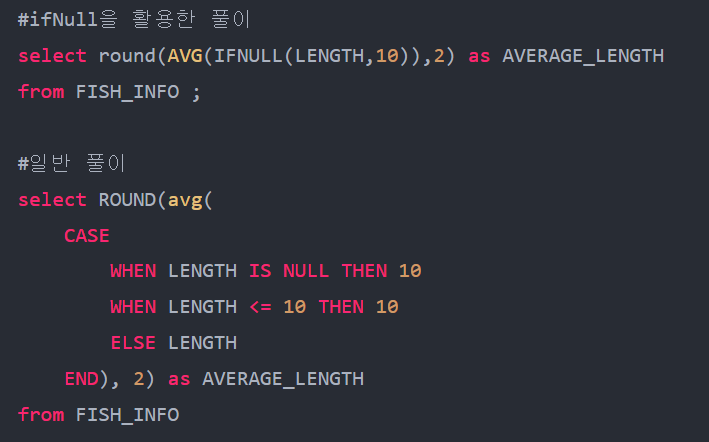

select <col>, <col> 
from [table]
where <col> = [value]
order by [col]

## select 함수
select top 1 <col> from ~
top 1 - 1행 반환
top @n - n행 반환
count(*) - 데이터 row 카운트 반환

# from
[table] as [별칭]

# where
=, >=, <= , >, <, <>, !<, !>
and, or, in, not in
```
where letter = 'a' or letter 'b'

where letter in ('a', 'b')
```
like - %, _, [] [^]
~~ WHERE '%#%%' ESCAPE '#'

between

# ORDER BY
SELECT * FROM [TABLE] ORDER BY <COL1> ASC, <COL2> DESC

----------------------
SELECT INDUSTRY, COUNT(*) AS CNT
FROM NASDAQ_COMPANY
WHERE <COL> = [VALUE]
GROUP BY INDUSTRY
HAVING <FUNC>(COL) = <VALUE>
order by ~~

---------------
select col
from table1 as t1 
inner join table2 as t2 on t1.col1 = t2.col1
where col = value
order by col asc
-----------------------

inner, left, right, full outer, cross

on은 join에 대한 조건
where은 결과에 대한 필터

# 서브쿼리
괄호로 묶어서 사용
서브쿼리에는 order by 사용 못함(최종적으로 보이는 데이터만 정렬 가능한 듯)

# 함수
select
concat(symbol, N'의 industry는 ', industry, N'입니다.')
from table where symbol = 'msft'

isnull(a, b) - a가 null이면 b 반환
coalesce(a, b, c) - 앞에서부터 확인해서 null이 아닌 걸 반환
ltrim, rtrim, trim('a' from 'aba') - 양쪽의 글자 제거
replace('aba', 'a', 'c') - 문자 대체
reverse('abcd') - 문자열 뒤집기

getdate() - 현재 시간 반환
dateadd(year, 1, '2021-04-01') - 날짜 계산
datediff(day, '날짜1', '날짜2')
datename(weekday, '날짜') - 문자열로 반환

contert(반환 데이터 타입[길이], 변환하려는 값, 스타일) - 길이와 스타일은 선택사항

## 그룹함수
count() - null이 아닌 행 수
sum - 숫자의 합
avg - 숫자의 평균값
min - 최소값
max - 최대값
distinct - 중복 제거
```
SELECT DISTINCT department
FROM employees;
```
cube - 모든 조합에 대한 집계
```
SELECT department, year, SUM(sales) AS total_sales
FROM sales_data
GROUP BY CUBE(department, year);
```
rollup - 가장 첫 기준에 따른 계층적 세부집계를 보여준 뒤, 마지막에 전쳬 합계 반환
```
SELECT department, year, SUM(sales) AS total_sales
FROM sales_data
GROUP BY ROLLUP(department, year);
```

LIMIT, OFFSET

## 수학함수
abs() - 절댓값
round(a, b) - 숫자 a를 소수점아래 b자리까지 반올림
power(a,b) - a^b 거듭제곱 반환
rand() - 0에서 1 사이의 랜덤값 반환
cats(a as 데이터타입) - a를 특정 데이터타입으로 변환
log(10) - 자연로그 반환
pi() - 파이값
square(a) - a의 제곱
sqrt(a) - a의 제곱근
row_number() - 행 번호
rank() - 순위 + 동일한 값 순위 인정
dense_rand() - 순위 + 동일한 값 순위 무시
ntile(3) - n개의 그룹으로 나눔
```
SELECT SalesID, SalesPerson, Amount,
    ROW_NUMBER() OVER (ORDER BY Amount DESC) AS RowNum
    RANK() OVER (ORDER BY Amount DESC) AS RankNum
    DENSE_RANK() OVER (ORDER BY Amount DESC) AS DenseRankNum
    NTILE(3) OVER (ORDER BY Amount DESC) AS NTileGroup
FROM Sales;
```

## 분석 함수
DATE_FORMAT




SELECT COUNT(*) COUNT 
FROM ECOLI_DATA 
WHERE GENOTYPE & 2 <> 2
AND (GENOTYPE & 1 = 1
OR GENOTYPE & 4 = 4)


& (비트 AND): 두 숫자의 비트 단위 AND 연산을 수행합니다. 두 비트가 모두 1일 때만 결과가 1이 됩니다.
| (비트 OR): 두 숫자의 비트 단위 OR 연산을 수행합니다. 하나 이상의 비트가 1일 때 결과가 1이 됩니다.
^ (비트 XOR): 두 숫자의 비트 단위 XOR 연산을 수행합니다. 두 비트가 다를 때 결과가 1이 됩니다.
~ (비트 NOT): 숫자의 비트를 반전시킵니다 (0은 1로, 1은 0으로).


SELECT COUNT(DISTINCT NAME) AS COUNT
FROM ANIMAL_INS